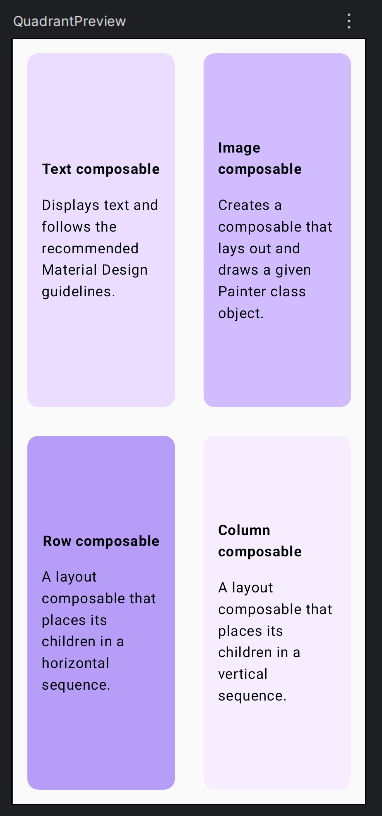
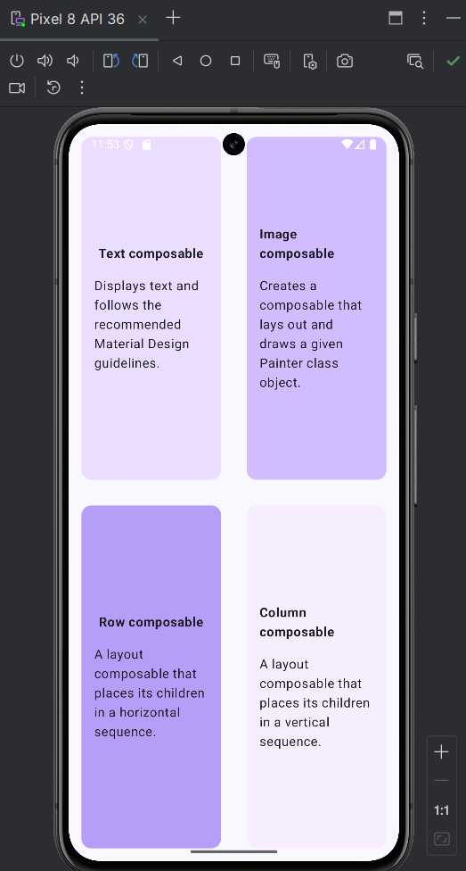

# ComposeQuadrantApp

An Android application built using Jetpack Compose that displays a four-section quadrant layout. The project demonstrates layout composition, reusable UI components, and structured screen design using modern Android development practices.

---

## Overview

This application presents a user interface divided into four equal sections, arranged in a two-by-two grid. Each section represents a different Jetpack Compose concept and is displayed using a styled card with a unique background color.

The layout is designed to demonstrate how multiple composables can be combined to create structured and visually balanced user interfaces.

---

## Screenshots

### Interface Design



### Running Application



---

## Technologies Used

* Kotlin
* Jetpack Compose
* Android Studio
* Material3

---

## Features

* Two-by-two quadrant layout
* Reusable composable component (`QuadrantCard`)
* Layout structuring using `Row` and `Column`
* Equal space distribution using `weight`
* Styled cards with different background colors
* Centered content using alignment modifiers

---

## Implementation Details

The main screen is composed using a `Column` that contains two `Row` elements. Each row holds two cards, forming a quadrant layout.

A reusable composable function is used to define each card:

* `Column` is used as the main container
* `Row` divides the screen horizontally
* `weight(1f)` ensures equal space distribution
* `Card` is used to style each section
* `stringResource` is used to retrieve text from resources

This approach ensures clean, maintainable, and reusable UI code.

---

## Project Structure

```id="q1y2z3"
app/
 ├── java/com/example/question3/
 │    ├── MainActivity.kt
 │    └── QuadrantScreen.kt
 │
 ├── res/
 │    ├── values/
 │    │    └── strings.xml
```

---

## How to Run

1. Clone the repository:

```
git clone https://github.com/LungeloMK/ComposeQuadrantApp.git
```

2. Open the project in Android Studio

3. Run the application on:

* Android Emulator
* Physical Android device

---

## Notes

* This project demonstrates UI composition using reusable components
* Focuses on layout structuring and visual organization in Jetpack Compose
* Developed as part of a practical exercise

---

## Author

Lungelo
